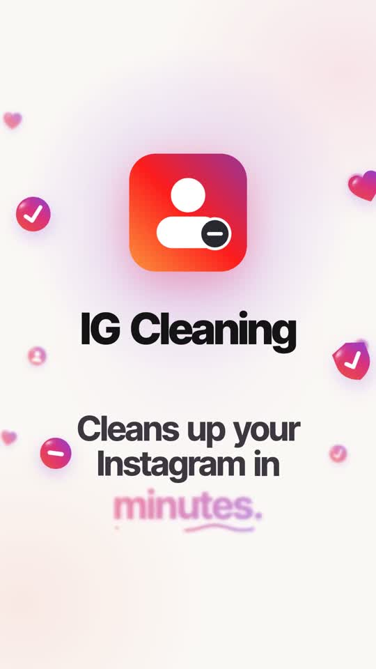

# IG Cleaning

**A free Mac app that unfollows the Instagram accounts that don't follow you back — or that you never talk to — at a human pace, without ever seeing your password.**



▶️ **Watch the 70-second demo:** https://nachosanbenito.com/ig-cleaning/
⬇️ **Download:** [IG-Cleaning.dmg](https://github.com/nachoie123/ig-cleaning/releases/latest/download/IG-Cleaning.dmg) (macOS 11+, Apple Silicon and Intel)

## What it does
1. **Analyzes your account.** Lists everyone you follow, who follows you back, and when you last messaged each one.
2. **Protects who matters.** Verified accounts and anyone above a follower threshold (10,000 by default) are shielded as "influencers"; a ★ whitelist keeps friends safe forever.
3. **You choose.** Filter by *doesn't follow me*, *we don't talk* or both. Select like in Finder: click, ⇧-click for a range, ⇧+arrows to extend, ⌘A for all.
4. **Unfollows slowly.** One account every 20–40 s, a 10-minute break every 25, max 60/hour and 150/day. At the first real warning from Instagram it stops for 24 h and permanently drops to a slower pace.
5. **Keeps a receipt.** An *Unfollowed* tab with photo, name and @username of everyone removed, with a *Follow again* button.

## Install
1. Open `IG-Cleaning.dmg` and drag **IG Cleaning** into **Applications**.
2. The first time, macOS says *"Apple could not verify “IG Cleaning” is free of malware…"*. That's normal for apps not notarized by Apple ($99/year). Click **Done**, then go to **System Settings → Privacy & Security**, scroll down and click **Open Anyway**. Only once.
3. Log in on the **Instagram** window (it's instagram.com itself) and press **Analyze my account**.

## Privacy & safety
- Your password is typed into Instagram's own web page; the app never sees or stores it.
- Every request runs inside that Instagram window, with your session. Nothing is sent anywhere except Instagram.
- Your data stays on your Mac in `~/Library/Application Support/IG Cleaning` — never inside the app.
- Only the control panel can talk to the Python side; the Instagram page can't. The panel has a strict Content-Security-Policy and escapes every username.

⚠️ Instagram does not officially allow automation. The pace above is conservative, but use it at your own risk.

## How it works
- **Python + [pywebview](https://pywebview.flowrl.com/)**: two native windows, the panel (`web/index.html`) and instagram.com.
- Requests use `fetch()` inside the Instagram window. Unfollows go through Instagram's own internal web module (`PolarisInstapi`), so each one is byte-for-byte the same request as clicking the button.
- Follower counts are read from the public profile description, streaming only the first bytes of each page.
- Packaged with PyInstaller as a universal2 app (`build.sh`).

## Run from source
```bash
./run.command      # creates .venv, installs pywebview + certifi, opens the app
./build.sh         # builds dist/IG Cleaning.app
```

## License
MIT
